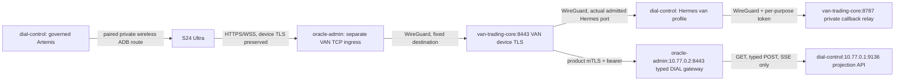

# Owner-selected VAN core routing and DDS reconciliation

Owner direction: use `van-trading-core` for VAN's backend; pair the S24 Ultra by wireless ADB through Artemis; qualify every Android capability through Artemis. The phone has wireless debugging enabled and is not paired. This report describes local implementation and prepared changes on 7 October 2026. It contains no live host, deployment, pairing or handset acceptance claim.

## Placement and connection contract

VAN backend and its local dependencies belong on `van-trading-core` (`10.77.0.4`). Hermes and Artemis remain on `dial-control` (`10.77.0.1`). The phone reaches VAN through a distinct VAN-only ingress on `oracle-admin`; the core receives the original TLS handshake and authenticates the hardware-bound client certificate. The existing DIAL product gateway continues to carry only typed development projections, actions and SSE. It cannot be used as the phone's VAN transport.

The distinct ingress capability is `VAN_OWNER_TLS_PASSTHROUGH_V1`. It is a prepared VAN design requiring an admitted typed deployment recipe and exact current capability receipt. Existing `PRODUCT_GATEWAY` workload labels, a supplied receipt string, or this report do not grant that capability. The limited DDS gateway's ban on WebSocket upgrades remains in place; opaque VAN TLS passes through a separately admitted fixed TCP lane. The separate ingress binds an explicitly observed oracle-admin VNIC address on a dedicated unprivileged port. It does not bind `10.77.0.2:8443`, replace the typed proxy, terminate phone TLS, trust a forwarded certificate header, or expose the core publicly.

`tools/runtime/prepare_owner_core_deployment.py` renders Android trust properties, core environment, fixed-target ingress, private Hermes callback relay and gateway resource limits. Its declaration says `PREPARED_NOT_DEPLOYED`, `ingress_authority_verified:false`, `deployed:false` and `live_qualified:false`. The committed example leaves runtime bindings empty and fails closed. Android's `VanProductionTarget` validates the selected host roles and matching public CA fingerprint using the external `VAN_DEPLOYMENT_PROFILE_FILE`; this validates shape and consistency, not a broker receipt's authority. Owner-signed arm64 release signing, attestation roots and connectivity signing material remain separately bound deployment requirements.

## Conflicts and concrete resolution

| Conflict | Resolution and current limit |
|---|---|
| Historical VAN app/README route points to the public gateway on `dial-control`; DDS assigns VAN backend to core. | Release target requires a core/oracle-admin deployment profile. The historical address is not accepted as the owner-core production target. Core keeps device-TLS, authority and evidence checks. No new public listener is added to dial-control. |
| Existing DDS product gateway accepts only typed `/v1/dev/*`, typed actions and SSE and explicitly removes WebSocket upgrade headers. | Preserve it. A separate fixed VAN TLS passthrough capability carries VAN owner APIs and WSS to the private core. Admission, binary pin, binding and firewall rules are pending governed execution. |
| DDS deployment docs say the projection API does not exist. | It exists in `agent-system/orchestration/development-projection/server.mjs`, with installer and 16 passing existing HTTP-boundary tests. Replace the stale claim with implemented/unqualified wording; code existence is not current deployed readiness. |
| DDS September 24 docs say core is not an overlay peer; September 25 topology records enrollment. | Replace the outdated gate with the recorded September 25 observation and a fresh-handshake requirement. Do not promote historical enrollment to present connectivity. |
| DDS projection README instructs core to bypass oracle-admin and call control `9136` directly. | Prepared DDS patch replaces the route with product mTLS at `https://10.77.0.2:8443`, and the control firewall source with `10.77.0.2/32`. No direct fallback. |
| VAN's DIAL development client previously had no product client certificate or custom CA loading. | Implemented gateway-side `VAN_DIAL_DEV_TLS_CA_FILE`, `VAN_DIAL_DEV_TLS_CLIENT_CERT_FILE`, `VAN_DIAL_DEV_TLS_CLIENT_KEY_FILE`. Actual reads and SSE use TLS 1.3, hostname verification and product client identity. Production refuses enabled direct/control routes, incomplete TLS bindings and group/world-readable private keys before any HTTP request. Disabled remains explicitly unavailable. Credentials do not reach Android. |
| Artemis tools operate only on admitted serials and expose no wireless pair/admit tool. | Current `dial_android_*` operations are insufficient to pair this handset. A governed ephemeral pairing → connection → hardware identification → one-use admission route must exist before Artemis tasks. No pairing code enters chat, source, logs or screenshots. |
| Synchronous Artemis test execution can return a run ID without registering a Hermes-owned trace, while trace inspection requires an owned task record. | Preserve this as a DDS implementation gap. Qualify through the existing admitted task-start/manage/inspect lane; an authorized DDS change must register synchronous trace ownership and add refusal/recovery tests before using synchronous trace receipts as acceptance. |

The DDS corrections are a source-bound proposal under `docs/audit/dds-owner-core-reconciliation/`, not changes to the DDS checkout or Project Truth. Its immutable source commit is `64d6b7158c723b7700e5b53175ea8048d4e92d00`. DDS's `AGENTS.md` and `CLAUDE.md` require ordinary project work to enter the persistent Oracle orchestrator, and the Project Truth protocol requires an owner-originated job plus append-only authorization. No current Global DIAL/Oracle connector/job is available in this session; no authorization job, active-writer boundary, gate state or recipe has been fabricated.

## Cross-repository acceptance sequence

1. Obtain current governed status and bind this exact owner direction to the existing project writer at a safe boundary. Validate clean immutable VAN/DDS source revisions, canonical release gates, host identity and current WireGuard handshakes. Core hostname alone is insufficient because historical estate records describe two similarly named OCI instances; match the retained instance identity.
2. Admit the narrow VAN ingress capability and pinned proxy artifact through a typed recipe. Allow oracle-admin `10.77.0.2 → 10.77.0.4:8443/tcp` and replies on the hub without source NAT. Add exact peer `/32` routes and core ingress firewall scope. Preserve recovery rules and trading-managed firewall chains.
3. Bind the observed Hermes listener on `10.77.0.1:<port>`, with its profile credential; authorize core's source `/32` only. Allow control `10.77.0.1 → 10.77.0.4:8787` only for the fixed private callback relay. VAN's existing per-purpose token middleware remains mandatory. Public core/control endpoints and a generic tunnel are not substitutes.
4. Qualify the separate DDS path: core `10.77.0.4 → oracle-admin10.77.0.2:8443`, product mTLS identity `van`, separate bearer, then oracle-admin `→ control10.77.0.1:9136`. Verify read, SSE, typed action and independent readback. Induce wrong CA, wrong/expired product cert, absent bearer, direct-route refusal, denied methods/paths, stale projection, 429 and upstream outage. No owner action is retried blindly or queued as an unacknowledged replacement.
5. Verify matching phone TLS SAN/CA, signed connectivity manifest and APK trust anchors. Provision through the admitted installer route. Read back exact device binding, grant, certificate and `session.transport.admitted` receipt. Activity launch and connectivity status alone are insufficient.
6. Establish Artemis wireless pairing through the admitted private network route and confidential short-lived pairing UI. Match the physical S24 identity before adding its serial to the governed allowlist. Verify a current connected/admitted observation; then run the feature/state matrix in `tools/certification/ARTEMIS_ANDROID_ACCEPTANCE.md` and its registry-derived plan.
7. Execute real command → Hermes → provider effect → independent readback → handset presentation journeys, plus disconnection, lost reply, process death, rotation, reboot, permission denial/revocation, expired credentials and biometric refusal. Preserve unknown effects as unknown and verify no duplicate mutations. Use isolated test objects and demo trading authority. Require current task/trace IDs, source hashes, device identity, before/after service receipts and owner-visible evidence.

Core resource headroom is a deployment admission requirement. The prepared memory/CPU limits constrain the gateway but do not prove aggregate headroom for Supabase, n8n, Temporal, browser workers and VATI. Measure competing workload pressure before deployment and refuse any rollout that degrades trading/risk isolation. Provider credentials, the connected Artemis route, deployment authority, private network reachability and phone-side consent remain explicit live gates.

## Local evidence

The existing DDS projection test file ran with the repository's actual runner: `./node_modules/.bin/vitest run tests/development-projection-api.test.mjs --reporter=dot` → **16 passed**, 2.36 seconds. The initial `node --test` invocation rejected the Vitest hooks; it was a runner mismatch and does not establish a product failure. The passing run uses temporary test stores and loopback HTTP and does not certify estate deployment. Its bounded output is retained in this proposal directory.

The source-bound DDS patch is checked with `git apply --check` against the untouched recorded checkout. The manifest records input hashes and proposed after hashes. It modifies stale deployment guidance only; it does not implement/admit the new ingress capability, change host roles, issue credentials, create an authorization record or open any Project Truth release gate.

The actual VAN TLS fixture and production-route file passed **17 tests**, 8.80 seconds. It performs real TLS 1.3 GET/SSE handshakes against a temporary client-certificate-required server and induces wrong CA, untrusted client, absent client and hostname failure. Production-route cases verify refusal before transport. The preceding related proxy/attention run passed **164 tests** (16 new and 148 existing), 55.13 seconds, before adding the final Settings-binding case. These runs overlap and must not be added together. `van-product-mtls-local-receipt.json` records test scope and current source hashes observed after execution; it does not claim a before/after frozen snapshot. Root's final integrated validation supplies source-freeze evidence and broader coverage.
