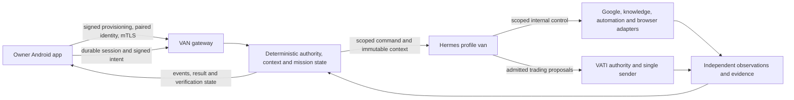

# VAN owner functionality and end-to-end review

**Historical audit baseline.** The authorized implementation follow-up and current acceptance limits are in [VAN implementation and acceptance](VAN_IMPLEMENTATION_ACCEPTANCE_2026-10-07.md). Counts, open source gaps and validation below belong to this audit phase; the current registries retain that provenance separately from implemented functions.

Audit date: 2026-10-07. Baseline: `12feb9033dfc1dd68d7b4d41ac477f0d9dbbc4af` on `main`. This review includes the local corrective changes described below. It does not certify a deployed host or handset.

**VAN is not yet demonstrated to be complete end to end.** The repository has substantial deterministic authority, gateway, mission and service logic, but the audit reproduced connection, authority, receipt, readiness and owner-control defects. Confirmed defects were corrected with regressions. Required owner surfaces, signed routing updates and live/device acceptance still have gaps.

## The contract for the redesign

The [feature registry](../../registries/owner_features.json) specifies 42 owner capabilities. The [screen registry](../../registries/owner_screens.json) specifies 65 screen/surface entries: 55 baseline entries and 10 explicitly proposed detail surfaces. A null route with `proposed_route` identifies a required redesign surface, not a navigation path already implemented.

The [endpoint registry](../../registries/owner_endpoints.json) contains 277 HTTP/WebSocket declarations, including conditional browser routes. It includes authentication, hardware proof requirements, request parameters/bodies, response schemas, source locations and stable endpoint IDs. [Schema components](../../registries/owner_endpoint_schemas.json) resolve the referenced request/response models. Endpoint existence is not evidence of a live service or permission for Android to invoke it.

The [searchable frontend contract](OWNER_FRONTEND_CONTRACT.html) presents the feature, screen and endpoint registries together. It is self-contained and opens offline.

Every feature names its owner goal, information, interactions, source authority, endpoint references, Android callsites, baseline coverage, screen links and happy/error acceptance requirements. Baseline gaps remain recorded even where this audit supplied a corrective patch; the findings below record the correction separately. The registries supplement the existing canon rather than replace the Security Policy or capability authority.

The owner domains are:

| Domain | Required owner experience |
|---|---|
| Home and conversation | Current state, briefing, text/voice/share input, preserved turn, answer and evidence, pending/queued/unknown status |
| Work and missions | Goal, progress, agents, dependencies, blockers, activity, evidence, exact mission targeting, intervention and cancellation consequences |
| Attention and approvals | Triage, acknowledgement, snooze, decisions, reconfirmation, exact-action biometric approval, denial/expiry feedback |
| Reminders | Create, inspect, edit/cancel/resolve, due/fire status, timezone and delivery evidence |
| Memory and learning | Facts, provenance, history, conflicts, correct/forget/export/erase, understanding confirmation, adaptation rollback, goals and unresolved threads |
| Projects and development | Truth freshness, phase, blockers, rationale, plans/tasks, workspaces, review/CI/security evidence, typed admitted controls |
| Connected services | Gateway/session/Hermes separately, Google identity/credential planes and per-capability readiness, private knowledge/research, quotas and recovery |
| Automation and browser | Standing authority, admitted workflow/version, execution vs verified result, escalation, control ownership, interactive session/media, downloads/uploads/clipboard policy |
| Trading | Portfolio/risk, positions and protection, thesis/opportunity/chart/history, account setup, strategy validation/promotion, owner-signed halt and ticket decisions |
| Settings and devices | Signed onboarding, pairing/binding/mTLS, recovery, microphone/notification/overlay permissions, quiet hours, voice assets, diagnostics and credential revocation |
| Floating assistant and embodiment | Contextual command/result cards, attention and approval parity, voice state, connection/degraded state and truthful outcome projection |

Every destination must render loading, content, empty, error, degraded, offline and stale states. Access-required, approval-required, cancelled, expired, conflicted and unknown-outcome states are additional functional requirements. Empty data must not hide failed retrieval; accepted work must not look verified; an unavailable service must not look absent.

## Connection and authority architecture



Android connects to the gateway, not independently to the Hermes agent loop. Browser signalling/media is a deliberate separate path using a gateway-minted scoped grant. The device receives owner-safe projections and signed intent/control contracts. Internal runtime credentials, broker secrets and worker authority must never become frontend configuration.

The committed Android endpoint is a direct private-CA-pinned mTLS listener. Earlier tunnel-oriented documents are historical deployment guidance, not current connectivity evidence. A healthy gateway, a healthy Hermes profile, an authenticated Google credential, a ready capability and a working browser media peer are separate measurements.

## Confirmed corrections

The following defects were reproduced locally or traced through the actual application callsite and corrected. Device and live-host acceptance remains separate.

| ID | Defect | Correction / relevant source |
|---|---|---|
| VA-001 | Provisioning later in the process and socket failure could leave the durable session unstarted/offline indefinitely | Idempotent startup after provisioning/network/health recovery, generation-fenced single reconnect worker; `VanApplication`, `ProvisioningActivity`, `VanHermesSessionManager` |
| VA-002 | Replay dropped pending entries, deleted durable messages as soon as socket bytes were buffered, or lost their session identity on process restart | Persist eligible live sends before transmission; retain until acknowledgement/reconciliation; preserve remaining entries on send failure; restore one recorded session/epoch and hold conflicting records rather than guess |
| VA-003 | Transient resume HTTP failure was treated as an unknown session and abandoned queued work | Only an explicit authenticated unknown-session response may replace the session; transport failures preserve work and retry |
| VA-004 | Successful pairing followed by binding failure consumed the ticket, making ordinary retry impossible | Resume the exact signed provisioning attempt using atomically persisted pairing fingerprint, challenge-aware key handling and authoritative bound-key comparison |
| VA-005 | Untrusted shared/notification text signed with a weaker claimed class could become canonical owner memory | Check the resolved effective class/trust boundary before deterministic mutation; third-party content remains data |
| VA-006 | Conflicting request could poison the original idempotency receipt; failed retry claims were not atomically reacquired | Preserve original claim/receipt on conflict and acquire matching failed claims transactionally |
| VA-007 | Cancelled mission retained command/action authority | Refuse new execution under terminal mission authority, including already prepared actions |
| VA-008 | Safe retry rebuilt sealed context; uncertain remote acceptance could duplicate a Hermes run | Preserve one sealed context, distinguish safe no-send/rejected retry from outcome unknown, cache unknown outcome and project WAITING_EXTERNAL / UNKNOWN |
| VA-009 | Malformed or empty upstream responses could crash health or be accepted without a real run identity | Validate bridge replies; malformed read health degrades and ambiguous POST acceptance remains unknown |
| VA-010 | OAuth revocation could leave Workspace READY and routable using old evidence | Current disconnected state overrides historical readiness; retain provenance but require renewed certification after reconnect |
| VA-011 | Gemini principal check looked for a status never written by registration | Use actual verified owner identity and independently evidenced credential authentication while preserving quota/capacity states |
| VA-012 | Connected read fields absent from `/v1/google/planes`; one provider's readiness could misrepresent others | Preserve plane response and add exact capability/principal contract; display independently evidenced capability states |
| VA-013 | Overlay trading routes lost the requested view/detail identity | Resolve legacy links to existing trading graph destinations and preserve trade identity |
| VA-014 | Notification policy screen could not discover apps whose notifications arrived | Persist observations separately from explicit owner choices; publish discovery updates to the settings screen |
| VA-015 | Mission deep links opened generic Work without selecting the named mission | Bind requested mission identity to the actual Work selection/read path |
| VA-016 | Attention acknowledgement, snooze and decision errors disappeared silently | Show pending/result/error feedback and keep failed items actionable |
| VA-017 | Running TLS listener ignored CLI-side revocations; another process could overwrite revoked state | Reload issuance authority and serialize readers/writers with a stable cross-process lock; real TLS and concurrent-process regressions |
| VA-018 | Trading scheduler captured an HTTP handler instead of the event bridge and failed every sweep | Separate bridge identity; registered app scheduler now publishes each closed trade event once |
| VA-019 | Service installers accepted custom roots/bin paths but installed units used defaults | Render resolved systemd path directives and environment roots while preserving user configuration |
| VA-020 | Same-SAN direct-link server certificates were never renewed near expiry | Renew through the existing CA without changing its pin; monitor direct device PKI separately from trading PKI |
| VA-021 | Browser subagent deadline advanced by step count rather than elapsed worker time | Check actual time before/after awaited work and before accepting worker completion |
| VA-022 | Browser worker's own done assertion was reported as owner success | Separate worker/execution completion from independent owner success; task projection and Android show UNVERIFIED |
| VA-023 | Generic runtime caller could certify its own action and overwrite a terminal receipt | Explicit trusted-observer boundary, real postcondition/evidence for mutation success, immutable terminal receipt handling |
| VA-024 | WebSocket admission bypassed the HTTP hardware-binding gate | Require active owner binding and a fresh signed handshake or server-verified matching mTLS identity; recheck token/binding authority during the connection; Android supplies hardware-signed headers |
| VA-025 | Ledger reconciliation lost explicit file permissions under a restrictive process umask and reused a predictable staging path | Create a unique private staging file, restore trusted existing ownership/mode before writing, then atomically replace; 0600/0640 and stale-symlink regressions |

## Remaining functional gaps

These prevent a whole-system completeness claim even after the corrections.

1. **Signed connectivity changes are not applied to production routing.** The verified connectivity registry is populated, but the audit did not find production readers that apply signed endpoint/pin/ICE updates. Safe rotation needs a complete transport selection and trust-overlap contract; persisting a manifest is insufficient.
2. **Lost initial pairing response needs a supported recovery protocol.** If the gateway commits the one-use pairing but the phone never receives its credentials, the hash-only token boundary cannot reconstruct them. The corrected client can resume a pairing it received; it cannot invent missing credentials. Reprovisioning must be an explicit owner-enrolment operation.
3. **Owner workflows are missing or partial.** Mission cancellation and messages to an existing mission have endpoints but no current owner UI controls. Reminders management, full memory history/erase/conflict handling, understanding/learning correction and rollback, permissions/autonomy, research evidence and automation/standing-intent supervision also need complete owner surfaces. The registries enumerate the API-backed parts and proposed screens.
4. **Privileged subsystem APIs are not Android APIs.** Workspace operations, runtime knowledge/research, automation and detailed observability include internal-only routes. An admitted signed owner command can request supported work; direct owner inspection/control needs an explicit safe projection. The design must not expose internal credentials or invent routes.
5. **Voice and floating flows have incomplete interaction parity.** Transcript/error/end-turn control, result-heard acknowledgement, attention/approval cards, queue reconfirmation and persistent exact route restoration require device-tested UX. WebSocket is wired; the HTTP message carrier has no production caller and SSE is only a descriptor in the current client. These fallback declarations do not prove transport failover. The current character is not a substitute for these controls.
6. **Independent verification is incomplete for standalone browser tasks.** Execution completion now truthfully says UNVERIFIED; the patch does not create an independent goal/postcondition observer where none exists. Bound missions must use real verifier evidence.
7. **Cancellation does not prove remote undo.** Gateway authority refusal blocks further admitted effects. Already submitted Hermes, browser or broker work requires operation-specific cancellation/reconciliation evidence; completed irreversible effects cannot be inferred to have been undone.
8. **Some registered services are descriptive rather than executable.** Generic computer-use workers are uninstalled, and some consumer Google entries have no executor. These must show unavailable/configured-only states rather than working actions.
9. **Full screen resilience is unfinished.** Baseline source presence does not prove all seven screen states, request cancellation, stale-data age, accessibility or owner recovery paths. These are acceptance requirements for the replacement frontend.
10. **Hermes ledger integration needs acceptance evidence.** Gateway reasoning/assumption APIs exist, but the current MCP shim does not expose the corresponding fill/clear operations. Callback ordering before run binding and remote run lookup/cancellation also need a defined, observed contract. A local bridge mock does not establish those agent-loop behaviors.
11. **Android build/device qualification is pending.** The default app ABI is arm64 while the current emulator workflow uses x86_64; that workflow does not qualify the shipped native dependency combination. The cloud build cannot currently fetch pinned Sherpa from JitPack because the proxy returns 403. A compatible APK build and hardware-backed owner-device acceptance remain release gates.

## Happy and error paths that must be accepted

| Flow | Happy-path evidence | Required failure/recovery evidence |
|---|---|---|
| Provisioning | Signed payload → pair → hardware attestation → client CSR/certificate → bound session | Invalid/expired signature/ticket, wrong owner device/pin, lost response, partial binding, revoked certificate |
| Connection | Authenticated health, proved open/resume, event cursor and admitted message acknowledgements | Gateway/Hermes independently offline, repeated network failures, process death, stale callback, transient resume failure, explicit replacement, routing/pin rotation |
| Safe command | Correct source/trust, sealed context, one command/mission and verified result | Untrusted input cannot become owner authority; duplicate/conflicting requests; missing/expired scope; unknown remote acceptance |
| Elevated write | Exact owner action digest, current biometric proof, per-occurrence approval and observed postcondition | Denial/expiry, changed payload, replay, lost response, prohibited action and offline storage refusal |
| Mission control | Named mission, progress/evidence, owner response and correlated result | Wrong/deleted identity, cancel race, remote work still pending, late callback, stale truth, unverified result |
| Google | Verified identity, correct credential plane, successful current canary and capability-specific state | Revocation, auth expiry, quota exhaustion, unavailable executor, one capability failing independently of others |
| Browser/automation | Admitted authority/version, live worker/media, scoped control and independent outcome | Deadline overrun, worker belief-only done, owner takeover, payment denial, missing host, upload/download policy, lease conflict |
| Memory/learning | Owner-confirmed provenance, bounded retrieval, correction/forget and readback | Shared/provider data remains untrusted, conflicting facts, stale snapshot, unauthorized mutation, incomplete erasure |
| Attention/reminders | Due state reaches owner, acknowledgement/snooze/resolve result is observed | Failed mutation remains visible, quiet hours, offline delivery, timezone ambiguity, repeated delivery, missed permission |
| Trading | Current ledger/feed, risk/single sender, owner-signed controls and broker confirmation | Stale feed, unavailable ledger, rejected mandate, partial cancel/flatten, ambiguous order receipt, wrong-account identity |

## Functional character contract

The redesigned Rive/renderer must consume the same deterministic state/event projection as the rest of the app. Required durable meanings include idle, attentive, listening, speaking, thinking, delegating, searching, working, waiting-external, waiting-for-owner, urgent, degraded, offline, connecting and sleeping. Finite effects include acceptance acknowledgement, presentation, confirmation of verified success, warning/unverifiable result, error, and panel open/close. Profit alone must never produce a success celebration.

Every visual meaning needs a corresponding readable sentence/card and an actionable control when the owner must respond. Reduced motion and renderer failure must preserve those meanings. Replacing the character asset must not change authority, outcome or connectivity semantics.

## Validation and deployment limits

Local regression evidence and final suite results are recorded in [the validation record](VAN_OWNER_E2E_VALIDATION_2026-10-07.json). Backend ASGI tests exercise application routes and SQLite; dedicated PKI tests exercise real local TLS and multi-process coordination; the JVM harness executes the actual session manager and pure production logic with controlled transport dependencies.

| Final suite | Passed | Skipped |
|---|---:|---:|
| Backend | 2016 | 0 |
| Contracts | 578 | 3 |
| Trading | 1276 | 5 |
| Services, Hermes/policy and scenarios | 204 | 1 |
| Android JVM harness | 1022 | 0 |
| **Total (disjoint suites; focused reruns excluded)** | **5096** | **9** |

The Python logs retain dependency deprecations, async-mark warnings and SQLite worker teardown warnings. They do not demonstrate deployed lifecycle behavior. Python compilation, runtime shell syntax, registry/reachability contracts and diff whitespace checks passed. The offline explorer's JavaScript passed syntax checking; rendered browser interaction was not run because a Playwright browser executable is absent.

The [cloud setup record](CLOUD_SETUP_2026-10-07.md) identifies the retained tools, reusable instructions and confirmed saved configuration draft. The draft adds `jitpack.io`; review/save/publish is required to activate it.

These do not substitute for an Android application build, a physical owner's hardware-backed attestation/biometric test, a deployed gateway/Hermes callback, live hosted-service canaries, browser media, trading transport or Rive acceptance. Historical receipts in the repository are not fresh certification of this modified tree. The final build attempt and concrete remaining environment blockers are recorded in validation.

All changes are local and reviewable. This audit did not publish/deploy them, install on the owner's phone, approve a trading mandate, supply production credentials or redesign the Rive artwork.

Detailed source/evidence reviews: [Android connectivity](supporting/android-connectivity.md), [gateway and Hermes](supporting/gateway-hermes.md), [hosted services](supporting/hosted-services.md), [owner surfaces](supporting/owner-features.md), and [deployment/tests](supporting/deploy-tests.md).

## Using the registries

Start frontend design from owner goals and controls, then bind each screen to its declared owner-accessible endpoint IDs and outcome states. Keep proposed routes distinct until implemented. Add owner-safe projections where the contract currently names only internal service APIs. Verify the whole owner loop rather than a port, provider status label or worker completion assertion.

Regenerate route/schema metadata with:

```bash
/workspace/.onboarding/van-venv/bin/python tools/audit/export_owner_endpoints.py
```

Run the endpoint/redesign contract tests from the repository root. They reject invented route references, inconsistent authentication, missing feature-screen links, internal credentials presented as phone access, and false readiness/proposed-route claims.
