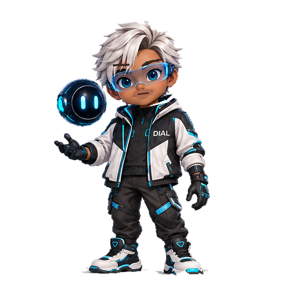
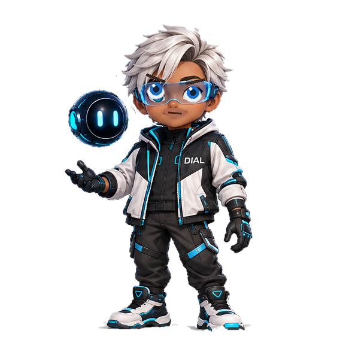
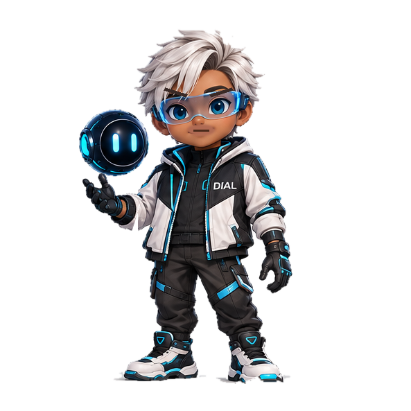
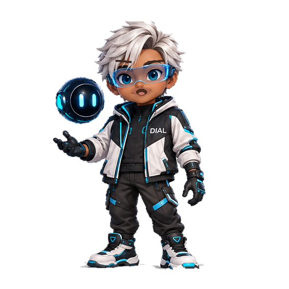
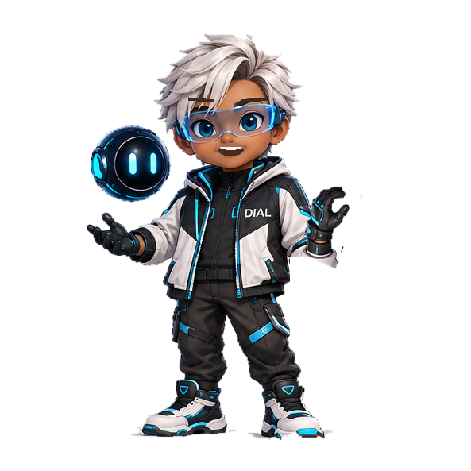

# Candidate B Character Previews

These are the exact Candidate B reference poses used by the VAN Character Forge. They are repository assets, not regenerated approximations.

| Idle | Listening | Thinking |
|---|---|---|
|  |  |  |

| Working | Speaking | Success |
|---|---|---|
|  |  |  |

Candidate B remains the visual authority. These poses are reference/evidence assets; they are not a claim that the final production `van.riv` has passed M1–M5.
